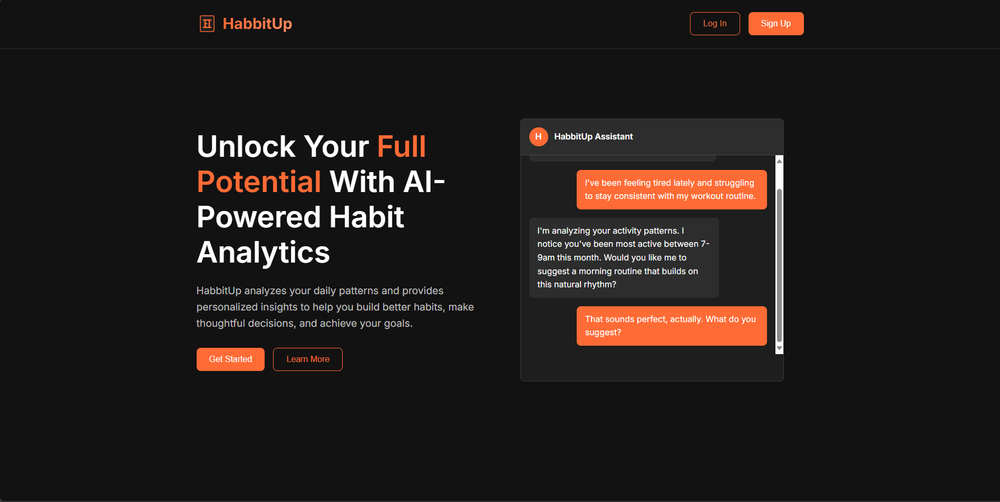
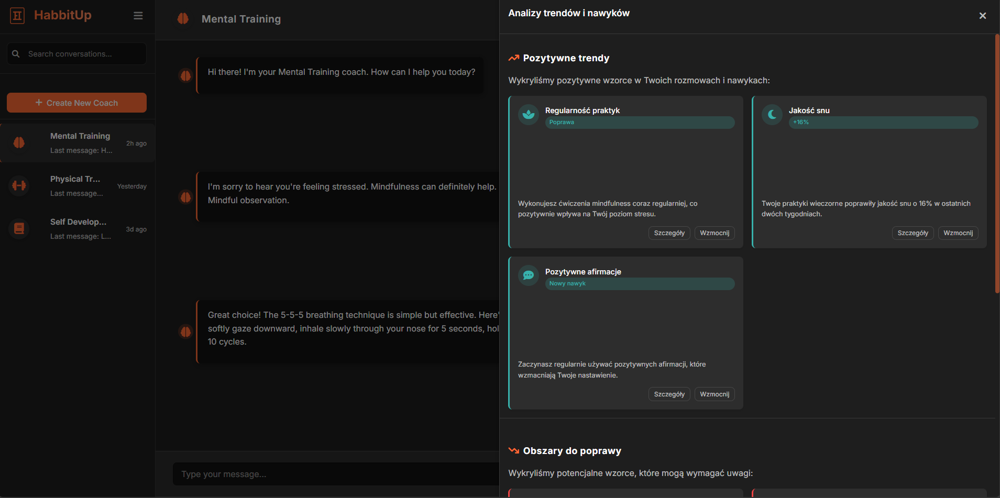
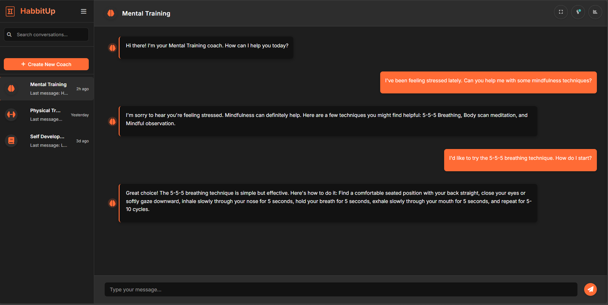

# 🧡 HabitUp - Your Personal Growth Assistant 🧡

## 📖 Project Description

**HabitUp** is an application designed to help users build healthy habits, manage daily tasks, and achieve their goals. By integrating advanced AI models, the app provides personalized advice, motivation, and real-time support.

The project was created for individuals who want to improve their productivity, take care of their mental and physical health, and grow in various areas of life.

---

## 🎯 Who is HabitUp for?

HabitUp is perfect for:
- 🧑‍💼 Professionals looking for a time management tool.
- 🧘‍♀️ Individuals who want to build healthy habits.
- 🏋️‍♂️ Trainers and coaches supporting their clients.
- 🌟 Anyone who needs motivation and support in achieving their goals.

---

## ✨ Features

- 🧠 **Personalized AI Assistant**: Your personal coach to help you build habits.
- ✅ **Task Management**: Create to-do lists and track your progress.
- 🔔 **Motivational Notifications**: Receive reminders and inspiring messages.
- 🔒 **Data Security**: Your data is protected with advanced security mechanisms.
- 🤖 **OpenAI Integration**: Leverages the latest AI technologies to personalize the user experience.

---

## 🛠️ Technologies

The project is built using the following technologies:
- **Backend**: Java (Spring Boot)
- **Frontend**: HTML, CSS, JavaScript
- **Database**: MySQL
- **AI**: OpenAI API
- **Security**: Spring Security

---

## 📸 Screenshots

1. **Home Page**  
   

2. **Trend Analysis**  
   

3. **AI Conversation Example**  
   

---

## 🚀 How to Run the Project?

1. **Clone the Repository**  
   ```bash
   git clone https://github.com/your-username/HabitUp.git
   cd HabitUp
   ```
